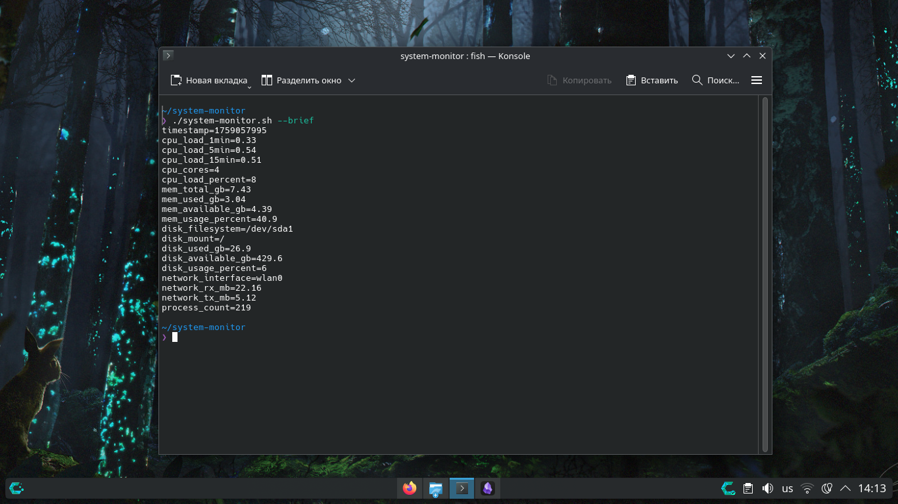

# System Monitor 🔍

[](https://www.gnu.org/licenses/gpl-3.0)
[](https://www.gnu.org/software/bash/)
[](https://www.linux.org/)

A powerful Bash script for real-time system monitoring. Displays CPU, memory, disk, and network metrics with colored output and threshold alerts.

**🇷🇺 [Russian Version](README.ru.md)**

## 📊 Features

- **CPU Monitoring**: Load average (1, 5, 15 minutes) and core utilization
- **Memory Tracking**: RAM usage, available memory, and utilization percentages
- **Disk Space**: Root partition usage with filesystem information
- **Network Statistics**: Interface details with RX/TX traffic monitoring
- **Process Count**: Total number of running processes
- **Color-coded Alerts**: Visual warnings for critical thresholds
- **Multiple Output Modes**: Interactive, brief (machine-readable), and single-run

## 🚀 Quick Start

```bash
# Make script executable
chmod +x system-monitor.sh

# Single system snapshot
./system-monitor.sh

# Real-time monitoring (3-second intervals)
./system-monitor.sh -i 3

# Machine-readable output for scripting
./system-monitor.sh --brief
```


## --help
system-monitor.sh - System Monitoring Tool (CPU, Memory, Disk, Network)

Usage: ./system-monitor.sh [OPTIONS]

OPTIONS:
  -i N         Update interval in seconds (default: single output)
  --brief      Brief output (machine-readable format)
  --no-color   Disable colored output
  --version    Show version information
  --help       Show this help message

EXAMPLES:
  ./system-monitor.sh                                  # Single output
  ./system-monitor.sh -i 5                            # Update every 5 seconds
  ./system-monitor.sh --brief                       # Brief output for scripting
  ./system-monitor.sh -i 2 --no-color          # No colors, 2-second interval

EXIT CODES:
  0 - Success
  1 - Invalid arguments
  2 - Missing dependencies


## 📋 Usage Examples
### Basic Monitoring

```
# Single system status check
./system-monitor.sh

# Monitor with 5-second intervals
./system-monitor.sh -i 5

# Disable colors (for logging)
./system-monitor.sh --no-color -i 2
```

### Integration with Other Tools

```bash
# Export metrics to file
./system-monitor.sh --brief > system_status.txt

# Monitor specific metric (using grep)
./system-monitor.sh --brief | grep "cpu_load_percent"

# Continuous monitoring with tee
./system-monitor.sh -i 10 | tee system_log.txt
```
## ⚙️ Installation
### Direct Download
```bash
wget https://raw.githubusercontent.com/yourusername/system-monitor/main/system-monitor.sh
chmod +x system-monitor.sh
```

### Clone Repository
```bash
git clone https://github.com/yourusername/system-monitor.git
cd system-monitor
./system-monitor.sh -i 3
```

## 🛠️ Requirements

- **Bash** 4.0 or newer
    
- **Linux** environment
    
- Basic utilities: `awk`, `grep`, `free`, `df`, `ps`
    
- Recommended: `bc` for advanced calculations

```bash
#Debian/Ubuntu/...
sudo apt install bc

#RedHat/Fedora/CentOS/...
sudo yum install bc

#Arch/ShefOS/Manjaro/CachyOS/...
sudo pacman -S bc
```

## 📈 Monitored Metrics
|Metric|Description|Warning Threshold|Critical Threshold|
|---|---|---|---|
|CPU Load|System load average|70% per core|90% per core|
|Memory Usage|RAM utilization|70%|90%|
|Disk Usage|Root partition space|80%|90%|
|Network I/O|Traffic statistics|N/A|N/A|
|Processes|Total running processes|N/A|N/A|

## 🎨 Output Samples

### Screeens





### Brief Mode
```bash
timestamp=1705587600
cpu_load_1min=0.75
cpu_load_5min=0.68
cpu_load_15min=0.55
cpu_cores=4
mem_total_gb=15.60
mem_used_gb=8.45
mem_usage_percent=54.2
```

## 🔧 Advanced Usage

### Custom Thresholds

Modify the `colorize()` function in the script to adjust warning/critical levels:

```bash
# Current thresholds (line ~45)
echo -e "Usage: $(colorize "${MEM_PERCENT}%" 70 90)"
# Change to: $(colorize "${MEM_PERCENT}%" 60 80) for more sensitive alerts
```

### Cron Job for Regular Monitoring

Cron is a time-based job scheduler in Linux. You can use it to run your monitor at regular intervals.

#### How to set up:

Open your crontab file:
```bash
crontab -e
```

Add a line for hourly monitoring (runs at the beginning of each hour):**
```bash
0 * * * * /full/path/to/system-monitor.sh --brief >> /var/log/system-status.log
```

#### Cron time format explained:
```text
# ┌───────────── minute (0-59)
# │ ┌───────────── hour (0-23)
# │ │ ┌───────────── day of month (1-31)
# │ │ │ ┌───────────── month (1-12)
# │ │ │ │ ┌───────────── day of week (0-6, Sunday=0)
# │ │ │ │ │
   0 * * * * command-to-execute
```

#### Useful cron examples:
```bash
# Every day at 6:30 AM
30 6 * * * /path/to/system-monitor.sh --brief >> /var/log/monitor.log

# Every 10 minutes
*/10 * * * * /path/to/system-monitor.sh --brief >> /var/log/monitor.log

# Every Monday at 9:00 AM
0 9 * * 1 /path/to/system-monitor.sh --brief >> /var/log/monitor.log
```

#### ⚠️ Important notes:

- Use `--brief` mode for cron (single output, not continuous)
    
- Specify full path to the script (`/home/username/...`)
    
- The script must be executable (`chmod +x system-monitor.sh`)
    
- Cron runs with a minimal environment - test thoroughly

### 🐳 **Docker Container Monitoring**

You can use this script to monitor resources inside Docker containers.

#### Prerequisites:

The container must have:

- **Bash** shell
    
- Basic Linux utilities: `ps`, `free`, `df`, `awk`, `grep`
    

#### Step-by-step guide:

**Check if the container has Bash:**
```bash
docker exec container_name which bash
```

**Copy the script into the container:**
```bash
docker cp system-monitor.sh container_name:/tmp/
```

**Make it executable inside the container:**
```bash
docker exec container_name chmod +x /tmp/system-monitor.sh
```

**Run the monitor:**
```bash
# Single snapshot
docker exec container_name /tmp/system-monitor.sh --brief

# Continuous monitoring (if supported)
docker exec container_name /tmp/system-monitor.sh -i 5
```

#### Example with a specific container:
```bash
# Monitor a PostgreSQL container
docker cp system-monitor.sh postgres-container:/tmp/
docker exec postgres-container chmod +x /tmp/system-monitor.sh
docker exec postgres-container /tmp/system-monitor.sh --brief
```

#### ⚠️ Limitations:

- **Minimal containers** (Alpine, scratch) may not have required utilities
    
- **Read-only containers** cannot have scripts copied in
    
- Some **system metrics** may not be available in containers
    

### 🔄 **Alternative: Run from host system**

You can also monitor containers from the host system:

```bash

# Monitor all containers resource usage
docker stats

# Monitor specific container from host
docker exec container_name cat /proc/loadavg
docker exec container_name free -h
```

## 🤝 Contributing

If you'd like to suggest improvements or report issues:

### 📝 **Easiest Way (Recommended):**

1. **Create an Issue** on GitHub - describe your idea or problem
    
2. **I'll implement the changes** myself and credit you in the commits
    

### 💻 **For Advanced Users (if familiar with Git):**

1. **Fork the repository** (click "Fork" in the top-right corner)
    
2. **Make changes** in your own repository
    
3. **Create a Pull Request** - I'll review and merge your changes
    

### 🐛 **Reporting Bugs:**

In your Issue, please include:

- Your operating system (Ubuntu, CentOS, etc.)
    
- Bash version (`bash --version`)
    
- Error message text
    
- What you expected to see
    

### 💡 **Improvement Ideas:**

- Add CPU temperature monitoring
    
- Support monitoring multiple disks
    
- Email/Telegram notifications
    
- Web interface or GUI
    

---

**Don't hesitate to share ideas!** Even simple suggestions are highly valuable. 🚀

-------
## 🐛 Troubleshooting

### "Command not found" errors

Ensure required packages are installed:

```bash
#Debian/Ubuntu/...
sudo apt install coreutils procps util-linux

#RedHat/Fedora/CentOS/...
sudo yum install coreutils procps util-linux

#Arch/ShefOS/Manjaro/CachyOS/...
sudo pacman -S coreutils procps util-linux
```


### "Permission denied"

Make script executable:

```bash
chmod +x system-monitor.sh
```

### No network statistics

Script uses primary route interface. Check available interfaces:

```bash
ip link show
```

----
## 📄 License

This project is licensed under the GPL v3 License - see the [LICENSE](LICENSE) file for details.

----
## 🙏 Acknowledgments

- Inspired by classic Unix monitoring tools (`top`, `htop`, `vmstat`)
    
- Color scheme inspired by modern terminal applications
    
- Thanks to the Bash scripting community for best practices
