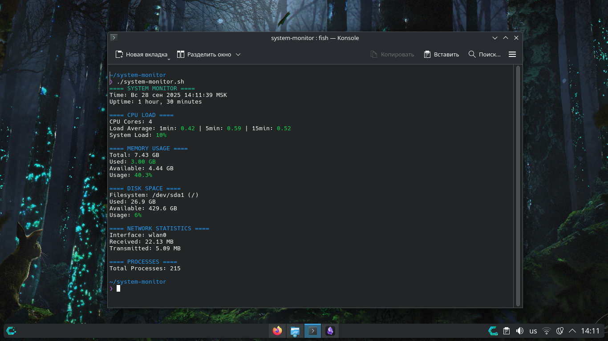
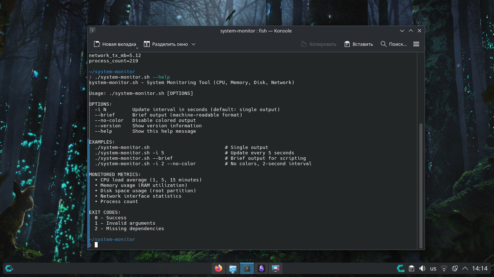

# System Monitor 🔍

[](https://www.gnu.org/licenses/gpl-3.0)
[](https://www.gnu.org/software/bash/)
[](https://www.linux.org/)
[](https://aur.archlinux.org/packages/system-monitor)

Мощный Bash-скрипт для мониторинга системы в реальном времени. Отображает метрики CPU, памяти, диска и сети с цветовыми предупреждениями.

**🇺🇸 [English Version](README.md)**

## 📊 Возможности

- **Мониторинг CPU**: Средняя загрузка (1, 5, 15 минут) и использование ядер
- **Отслеживание памяти**: Использование RAM, доступная память, проценты использования
- **Дисковое пространство**: Использование корневого раздела с информацией о ФС
- **Сетевая статистика**: Информация об интерфейсах, мониторинг трафика RX/TX
- **Количество процессов**: Общее число запущенных процессов
- **Цветовые предупреждения**: Визуальные предупреждения при критических значениях
- **Несколько режимов**: Интерактивный, краткий (для скриптов) и однократный вывод

## 🚀 Быстрый старт

```bash
# Даем права на выполнение
chmod +x system-monitor.sh

# Однократный снимок системы
./system-monitor.sh

# Мониторинг в реальном времени (интервал 3 секунды)
./system-monitor.sh -i 3

# Машиночитаемый вывод для скриптов
./system-monitor.sh --brief
```

## --help
```bash
system-monitor.sh — инструмент мониторинга системы (ЦП, память, диск, сеть)

Использование: ./system-monitor.sh [ОПЦИИ]

ОПЦИИ:
  -i N         Интервал обновления в секундах (по умолчанию: однократный вывод)
  --brief      Краткий вывод (формат, читаемый машиной)
  --no-color   Отключить цветной вывод
  --version    Показать информацию о версии
  --help       Показать это сообщение справки

ПРИМЕРЫ:
  ./system-monitor.sh                               # Один вывод
  ./system-monitor.sh -i 5                         # Обновление каждые 5 секунд
  ./system-monitor.sh --brief                   # Краткий вывод для скриптов
  ./system-monitor.sh -i 2 --no-color      # Без цветов, интервал 2 секунды

КОДЫ ВЫХОДА:
  0 — Успех
  1 — Недопустимые аргументы
  2 — Отсутствующие зависимости
```

## 📋 Примеры использования

### Базовый мониторинг

```bash
# Однократная проверка состояния
./system-monitor.sh

# Мониторинг с интервалом 5 секунд
./system-monitor.sh -i 5

# Без цветов (для логирования)
./system-monitor.sh --no-color -i 2
```

### Интеграция с другими инструментами

```bash
# Экспорт метрик в файл
./system-monitor.sh --brief > system_status.txt

# Мониторинг конкретной метрики
./system-monitor.sh --brief | grep "cpu_load_percent"

# Непрерывный мониторинг с записью в файл
./system-monitor.sh -i 10 | tee system_log.txt
```

## ⚙️ Установка
### Доступно в AUR (Arch User Repository):

```bash
yay -S system-monitor
# или
paru -S system-monitor
```

### Прямая загрузка (Все дистрибутивы)

```bash
wget https://raw.githubusercontent.com/DanLinX2004X/system-monitor/main/system-monitor.sh
chmod +x system-monitor.sh
sudo mv system-monitor.sh /usr/local/bin/system-monitor
```

### Клонирование репозитория

```bash
git clone https://github.com/DanLinX2004X/system-monitor.git
cd system-monitor
./system-monitor.sh -i 3
```

## 🛠️ Требования

- **Bash** 4.0 или новее
    
- **Linux** окружение
    
- Базовые утилиты: `awk`, `grep`, `free`, `df`, `ps`
    
- Рекомендуется: `bc` для точных вычислений
    


## 📈 Отслеживаемые метрики

|Метрика|Описание|Предупреждение|Критично|
|---|---|---|---|
|Загрузка CPU|Средняя загрузка системы|70% на ядро|90% на ядро|
|Использование памяти|Использование RAM|70%|90%|
|Использование диска|Пространство корневого раздела|80%|90%|
|Сетевая активность|Статистика трафика|N/A|N/A|
|Процессы|Всего запущенных процессов|N/A|N/A|

## 🎨 Примеры вывода

### Screeens






### Краткий режим

```bash
timestamp=1705587600
cpu_load_1min=0.75
cpu_load_5min=0.68
cpu_load_15min=0.55
cpu_cores=4
mem_total_gb=15.60
mem_used_gb=8.45
mem_usage_percent=54.2
```

## 🔧 Продвинутое использование

### Настройка пороговых значений

Измените функцию `colorize()` в скрипте для настройки уровней предупреждений:

```bash
# Текущие пороги (строка ~45)
echo -e "Использование: $(colorize "${MEM_PERCENT}%" 70 90)"
# Измените на: $(colorize "${MEM_PERCENT}%" 60 80) для более чувствительных предупреждений
```


### 📊 **Планирование мониторинга с помощью Cron**

Cron - это планировщик задач в Linux. Вы можете использовать его для регулярного запуска монитора.

#### Как настроить:

Откройте файл crontab:
```bash
crontab -e
```

Добавьте строку для ежечасного мониторинга (запуск в начале каждого часа):
```bash
0 * * * * /полный/путь/to/system-monitor.sh --brief >> /var/log/system-status.log
```

#### Формат времени cron объяснение:
```text
# ┌───────────── минуты (0-59)
# │ ┌───────────── часы (0-23)
# │ │ ┌───────────── день месяца (1-31)
# │ │ │ ┌───────────── месяц (1-12)
# │ │ │ │ ┌───────────── день недели (0-6, воскресенье=0)
# │ │ │ │ │
   0 * * * * команда-для-выполнения
```

#### Полезные примеры cron:
```bash
# Каждый день в 6:30 утра
30 6 * * * /путь/to/system-monitor.sh --brief >> /var/log/monitor.log

# Каждые 10 минут
*/10 * * * * /путь/to/system-monitor.sh --brief >> /var/log/monitor.log

# Каждый понедельник в 9:00 утра
0 9 * * 1 /путь/to/system-monitor.sh --brief >> /var/log/monitor.log
```

#### ⚠️ Важные заметки:

- Используйте режим `--brief` для cron (один запуск, не непрерывный мониторинг)
    
- Указывайте полный путь к скрипту (`/home/username/...`)
    
- Скрипт должен быть исполняемым (`chmod +x system-monitor.sh`)
    
- Cron запускается с минимальным окружением - тестируйте тщательно

### **Мониторинг Docker-контейнеров**

Вы можете использовать этот скрипт для мониторинга ресурсов внутри Docker-контейнеров.
#### Требования:

Контейнер должен иметь:

- **Bash** оболочку
    
- Базовые Linux утилиты: `ps`, `free`, `df`, `awk`, `grep`
    

#### Пошаговое руководство:

**Проверьте, есть ли в контейнере Bash:**
```bash
docker exec container_name which bash
```

**Скопируйте скрипт в контейнер:**
```bash
docker cp system-monitor.sh container_name:/tmp/
```

**Сделайте скрипт исполняемым внутри контейнера:**
```bash
docker exec container_name chmod +x /tmp/system-monitor.sh
```

**Запустите монитор:**
```bash
# Однократная проверка
docker exec имя_контейнера /tmp/system-monitor.sh --brief

# Непрерывный мониторинг (если поддерживается)
docker exec имя_контейнера /tmp/system-monitor.sh -i 5
```

#### Example with a specific container:
```bash
# Мониторинг PostgreSQL контейнера
docker cp system-monitor.sh postgres-container:/tmp/
docker exec postgres-container chmod +x /tmp/system-monitor.sh
docker exec postgres-container /tmp/system-monitor.sh --brief
```

#### ⚠️ Ограничения:

- **Минимальные контейнеры** (Alpine, scratch) могут не иметь нужных утилит
    
- **Контейнеры только для чтения** не позволяют копировать скрипты
    
- Некоторые **системные метрики** могут быть недоступны в контейнерах

### 🔄 **Альтернатива: Запуск с хостовой системы**

Вы также можете мониторить контейнеры с хостовой системы:

```bash
# Мониторинг использования ресурсов всех контейнеров
docker stats

# Мониторинг конкретного контейнера с хоста
docker exec имя_контейнера cat /proc/loadavg
docker exec имя_контейнера free -h
```

## 🤝 Участие в разработке

Если вы хотите предложить улучшение или сообщить об ошибке:

### 📝 **Самый простой способ (рекомендуется):**

1. **Напишите Issue** на GitHub - опишите идею или проблему
    
2. **Я сам внесу изменения** и упомяну вас в коммитах
    

### 💻 **Для продвинутых (если знакомы с Git):**

1. **Сделайте Fork** репозитория (кнопка "Fork" в правом верхнем углу)
    
2. **Внесите изменения** в свой репозиторий
    
3. **Создайте Pull Request** - я проверю и добавлю ваши изменения
    

### 🐛 **Сообщение об ошибках:**

В Issue укажите:

- Вашу операционную систему (Ubuntu, CentOS, etc.)
    
- Версию Bash (`bash --version`)
    
- Текст ошибки
    
- Что вы ожидали увидеть
    

### 💡 **Идеи для улучшений:**

- Добавление мониторинга температуры CPU
    
- Поддержка мониторинга нескольких дисков
    
- Уведомления по email/telegram
    
- Графический интерфейс
    

---

**Не стесняйтесь предлагать идеи!** Даже простые предложения очень ценны. 🚀

-----

## 🐛 Решение проблем

### Ошибки "Command not found"

Убедитесь, что установлены необходимые пакеты:
```bash
#Debian/Ubuntu/...
sudo apt install coreutils procps util-linux

#RedHat/Fedora/CentOS/...
sudo yum install coreutils procps util-linux

#Arch/ShefOS/Manjaro/CachyOS/...
sudo pacman -S coreutils procps util-linux
```

### "Permission denied"

Дайте права на выполнение скрипта:
```bash
chmod +x system-monitor.sh
```

### Нет сетевой статистики

Скрипт использует основной сетевой интерфейс. Проверьте доступные интерфейсы:

```bash
ip link show
```

## 📄 Лицензия

Этот проект лицензирован под GPL v3 License - смотрите файл [LICENSE](LICENSE) для деталей.

## 🙏 Благодарности

- Вдохновлено классическими Unix-инструментами (`top`, `htop`, `vmstat`)
    
- Цветовая схема вдохновлена современными терминальными приложениями
    
- Спасибо сообществу Bash-скриптинга за лучшие практики
